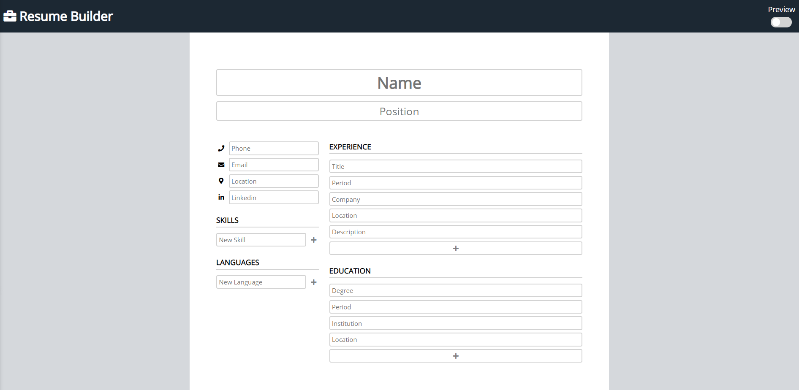

# Resume Builder Project

Project for [TheOdinProject](https://www.theodinproject.com/courses/javascript/) JavaScript curriculum.

The user can input information and generate a formatted resume.

## Features

- Edit mode to input information.
- Preview mode to view how the resume looks like.

**Possible future features:**

- Generate a PDF of the user's resume.
- Add responsiveness to mobile.

## Resources used

- [React](https://reactjs.org/)
- [Webpack](https://webpack.js.org/)
- JavaScript, CSS and HTML
- Icons by [Font Awesome](https://fontawesome.com/)

## Demo

Live version [here](http://fernanda-veiga.github.io/cv-project)



## How to use

To use the website, click [here](http://fernanda-veiga.github.io/cv-project).

To use the code, download the files and, on the file's directory, type the following on the terminal:

```
npm install
npm run start
```
